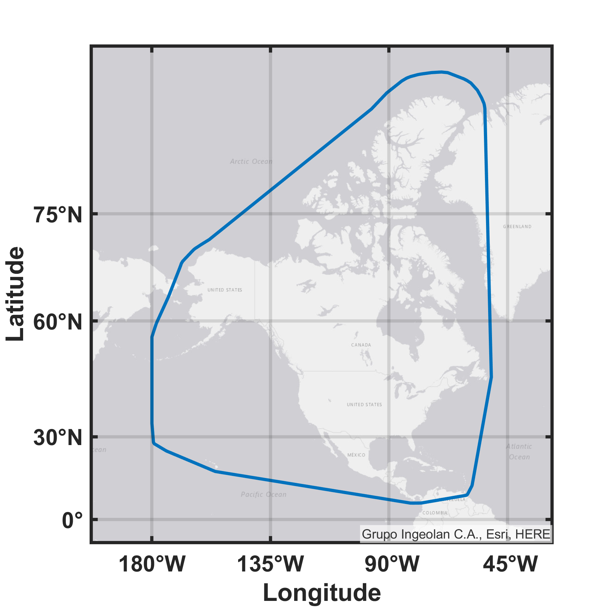
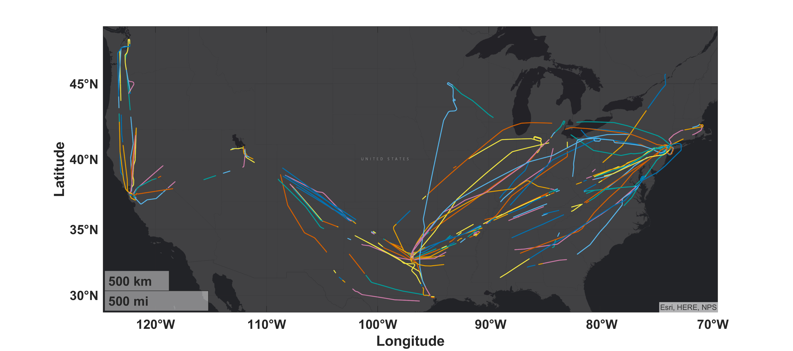
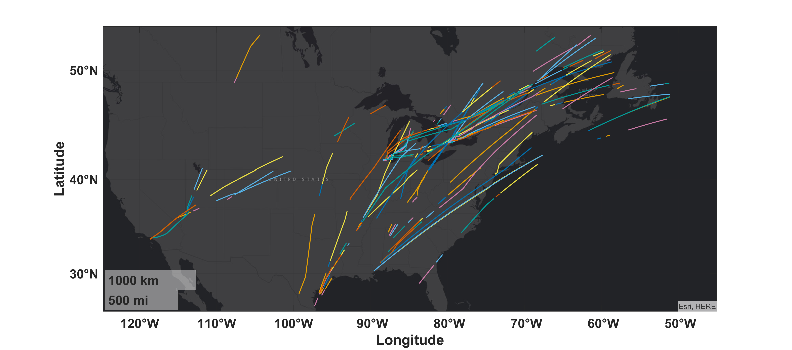
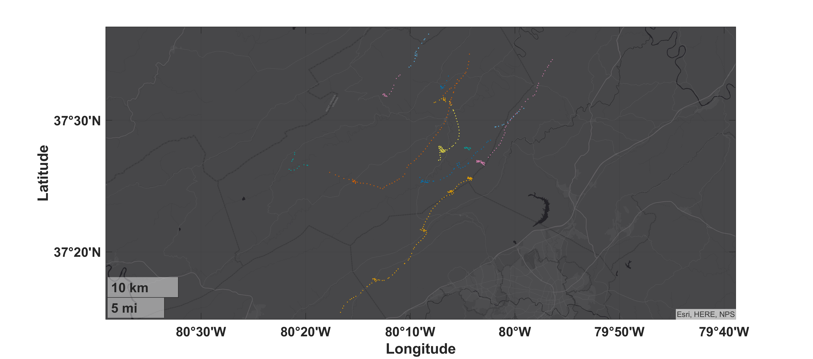
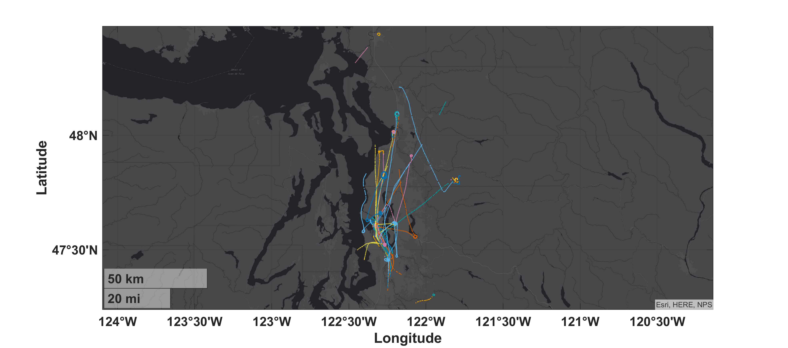

# OpenSky Network Processing

This repository is a collection of shell scripts and MATLAB code to process raw data from the [OpenSky Network](https://github.com/openskynetwork), a crowdsourced ADS-B receiver network that provides open access observations of aircraft.

- [OpenSky Network Processing](#opensky-network-processing)
  - [Nomenclature](#nomenclature)
  - [Introduction](#introduction)
    - [Overview of the OpenSky Network](#overview-of-the-opensky-network)
    - [Contribution](#contribution)
  - [Initial Setup](#initial-setup)
    - [Persistent System Environment Variables](#persistent-system-environment-variables)
    - [Scripts](#scripts)
    - [em-core](#em-core)
  - [Run Order](#run-order)
    - [Startup script](#startup-script)
    - [0. Create Directories For Organized Raw Data](#0-create-directories-for-organized-raw-data)
    - [1. Organize Raw Data](#1-organize-raw-data)
    - [2. Archive Organized Data](#2-archive-organized-data)
    - [3. Process Archived Organized Data](#3-process-archived-organized-data)
      - [Identify archived](#identify-archived)
      - [processSplitClean_3](#processsplitclean_3)
      - [Track Splitting](#track-splitting)
        - [Fixed Wing Multi-Engine: FAA (USA) Registered Aircraft](#fixed-wing-multi-engine-faa-usa-registered-aircraft)
        - [Fixed Wing Multi-Engine: IAA (Ireland) Registered Aircraft](#fixed-wing-multi-engine-iaa-ireland-registered-aircraft)
        - [Glider](#glider)
        - [Rotorcraft](#rotorcraft)
      - [Segment Cleaning and Processing](#segment-cleaning-and-processing)
      - [Identify cleaned track segments](#identify-cleaned-track-segments)
  - [Citation](#citation)
    - [Processing](#processing)
    - [OpenSky Network](#opensky-network)
    - [LLSC](#llsc)
  - [Distribution Statement](#distribution-statement)

## Nomenclature

Acronym | Phrase
 :--- | :---
ADS-B | [automatic dependent surveillance – broadcast](https://en.wikipedia.org/wiki/Automatic_dependent_surveillance_%E2%80%93_broadcast)
AGL | above ground level
HPC | high performance computing
LLSC | [Lincoln Laboratory Supercomputing Center](https://www.ll.mit.edu/r-d/cyber-security-and-information-sciences/lincoln-laboratory-supercomputing-center)
MSL | mean sea level

## Introduction

With the integration of unmanned aircraft systems into the U.S. National Airspace System, low altitude regions are being stressed in historically new ways. The FAA must understand and quantify the risk of UAS collision with manned aircraft during desired low altitude unmanned operations in order to produce regulations and standards. A key component of these risk assessments are statistical models of aircraft flight. Previous risk assessments used models for manned aircraft based primarily on Mode C-based secondary surveillance radar observations. However, these models have some important limitations when used at low altitude. We demonstrate a methodology for developing statistical models of low altitude manned flight or applicable at low altitudes that leverages the OpenSky Network, a crowdsourced ADS-B receiver network that provides open access to the aircraft data, and the FAA aircraft registry, an open database of registered aircraft. Unlike Mode C surveillance, a key advantage to this method is the availability of necessary metadata to distinguish between different types of low altitude aircraft. For example, previous models did not discriminate a large commercial aircraft transiting to higher altitudes from low altitude or small general aviation aircraft cruising at low altitudes. We use an aircraft's unique Mode S address to correlate ADS-B reports with aircraft type information from the FAA registry. We filter surveillance data and statistically characterize the low altitude airspace based on aircraft type, performance, and location.

### Overview of the OpenSky Network

The OpenSky Network collects data via a worldwide network of crowdsource receivers of ADS-B, an operational surveillance technology for tracking aircraft. The network, started in 2012 with 12 European sensors, has grown to over a thousand worldwide active sensors. ADS-B Equipped aircraft automatically self-report their position to ground stations and other equipped aircraft.

### Contribution

This software downloads, organizes, and processes aggregate ADS-B data collected by the OpenSky Network. The processed data can then be used to further efforts, such as training airspace encounter models.

## Initial Setup

This section specifies the run order and requirements for the initial setup the repository. Other repositories in this organization are reliant upon this setup being completed.

### Persistent System Environment Variables

Immediately after cloning this repository, [create a persistent system environment](https://superuser.com/q/284342/44051) variable titled `AEM_DIR_OPENSKY` with a value of the full path to this repository root directory.

On unix there are many ways to do this, here is an example using [`/etc/profile.d`](https://unix.stackexchange.com/a/117473). Create a new file `aem-env.sh` using `sudo vi /etc/profile.d/aem-env.sh` and add the command to set the variable:

```bash
export AEM_DIR_OPENSKY=PATH TO /em-processing-opensky
```

You can confirm `AEM_DIR_OPENSKY` was set in unix by inspecting the output of `env`.

### Scripts

This is a set of boilerplate scripts describing the [normalized script pattern that GitHub uses in its projects](https://github.blog/2015-06-30-scripts-to-rule-them-all/). The [GitHub Scripts To Rule Them All](https://github.com/github/scripts-to-rule-them-all) was used as a template. Refer to the [script directory README](./script/README.md) for more details.

You will need to run these scripts in this order to download the raw data from the OpenSky Network.

1. [setup](./script/README.md#scriptsetup)

### em-core

If you have not already, complete the initial setup associated with the [`em-core`](https://github.com/Airspace-Encounter-Models/em-core) repository. Notably, the functionality associated with `msl2agl.m`, `RUN_Airspace_1.m`, and `RUN_readfaaacreg.m` from that repository are required here.

## Run Order

Code developed and tested for Matlab R2019b in Windows and Unix. The local dev machine had a CPU of Intel Xeon Gold 6130 at 2.10GHz and 64 GB of RAM. The LLSC was also used for large parallel and batch processing; however not all the LLSC code has been publicly released.

### Startup script

At MATLAB startup, run [`startup_opensky`](startup_opensky.m) to set the MATLAB path and configuration.

### 0. Create Directories For Organized Raw Data

First, run [`RUN_0_createdirectories_serial`](RUN_0_createdirectories_serial.m) which creates directories based on the output of `RUN_readfaaacreg.m` from `em-core`. This script does not process or data manipulation. Rather it creates the directories in a manner that is efficient for HPC storage and load balancing.

Specifically, [`organizeraw_1`](organizeraw_1.m) has the following input parameters:

| Variable  |  Description | Example |
| :-------------| :--  | :-- |
| inYear | Year | `2020`
| outDirParent | Root directory to create directories  | `[getenv('AEM_DIR_OPENSKY') filesep 'output' filesep '1_organize' filesep num2str(inYear)]`
| dirRaw | Directory where raw data is hosted | `[getenv('AEM_DIR_OPENSKY') filesep 'data']`
| outFile | Full file path to save metadata | `[getenv('AEM_DIR_OPENSKY') filesep 'output' filesep sprintf('0_Tdir_%i_%s',inYear,datestr(date,'YYYY-mm-DD'))]`
| dirLimit |  Target maximum of items per directory | `1000`
| fileFAA | Full path to parsed American aircraft registry | `[getenv('AEM_DIR_CORE')  filesep 'output' filesep 'acregfaa-' num2str(inYear) '.mat']`
| fileTC | Full path to parsed Canadian aircraft registry | `[getenv('AEM_DIR_CORE')  filesep 'output' filesep 'acregtc-' num2str(inYear) '.mat']`
| fileILT | Full path to parsed Dutch aircraft registry | `[getenv('AEM_DIR_CORE')  filesep 'output' filesep 'acregilt-' num2str(inYear) '.mat']`
| fileIAA | Full path to parsed Irish aircraft registry | `[getenv('AEM_DIR_CORE')  filesep 'output' filesep 'acregiaa-' num2str(inYear) '.mat']`

In addition to creating directories, a table named `Tdir` for medtadata is created with the following columns:

| Variable  |  Description | Example |
| :-------------| :--  | :-- |
| icao24 | Mode S code (base 16 / hex)  | A4BCC3
| acType  | Aircraft type  | FixedWingMultiEngine
| acMfr | Aircraft manufacturer | BOEING
| acModel | Aircraft model | 707-321B
| nSeats | Number of seats (if known) | 192
| regType | Owner type (*US only*) | GOVERNMENT
| iso3166_1| ISO 3166-1 alpha-2 code of country where aircraft registry was sourced | US
| folderOrganize | Directory created to organize raw data | output/1_organize/2020/FixedWingMultiEngine/Seats_150_200/A4B996_A4C104

### 1. Organize Raw Data

Next, run `RUN_1_organizeraw_*` which calls [`organizeraw_1`](organizeraw_1.m) to organize the raw data by aircraft type, ICAO24 address, and date. This function also does some minor processing:

- Identify aircraft type using the ICAO24 address and the output of `RUN_readfaaacreg.m` from `em-core`.
- Convert to U.S. aviation units, as recommended by the [organization contributing guidelines](https://github.com/Airspace-Encounter-Models/em-overview/blob/master/CONTRIBUTING.md#units)
- Identify if all barometric altitude reports for unique aircraft are above 18,000 feet MSL (FL180)
- Remove reports with incomplete or missing position reports
- Remove observations outside of user-defined polygon based on [ISO 3166-1 alpha-2](https://en.wikipedia.org/wiki/ISO_3166-1_alpha-2) and generated by [`genBoundaryIso3166A2`](genBoundaryIso3166A2.m). The default boundary is a convex hull with a buffer of 60 nautical mile around approximately North America, Central America, Caribbean, and Hawaii: <center></center>

Specifically, [`organizeraw_1`](organizeraw_1.m) has the following input parameters:

| Variable  |  Description | Example |
| :-------------| :--  | :-- |
| dt | Date  | `2018-02-05`
| inHour  | Hour  | `12`
| inDir | Directory of raw data to be organized | `[getenv('AEM_DIR_OPENSKY') filesep 'data']`
| dirFile | Output from [`RUN_0_createdirectories_serial`](RUN_0_createdirectories_serial.m) | `[getenv('AEM_DIR_OPENSKY') filesep 'output' filesep '0_Tdir_2020_2020-06-16.mat']`
| isFilterISO3166A2 | If true, only include observations within specified ISO 36110-1 alpha-2 boundaries | `true`
| iso_a2 | List of ISO 36110-1 alpha-2 codes| `{'US','CA','MX','AW','AG','BB','BS','BM','CU','CW','JM','KY','PA','PR','TC','TT'}`
| bufwidth_deg | Buffer, in degrees, around ISO 36110-1 alpha-2 boundaries | `1`

### 2. Archive Organized Data

After the raw data has been organized, it needs to be archived and then individual files need to be removed. First run [`RUN_2_zipOrganized`](RUN_2_zipOrganized.sh) which calls [zipOrganized_2](zipOrganized_2.sh), followed by [RUN_2_rmOrganized](RUN_2_rmOrganized.sh) which calls [rmOrganized_2](rmOrganized_2.sh).

The first script will find all directories used by when organizing the raw data in step 1. If using the default output directories, the script defaults to this behavior for finding the directories:

``` bash
find "$(cd /output/1_organize ; pwd)" -mindepth 1 -maxdepth 1 -type d> $AEM_DIR_OPENSKY/output/2_dirArchiveDepth1.txt
find "$(cd /output/1_organize ; pwd)" -mindepth 2 -maxdepth 2 -type d> $AEM_DIR_OPENSKY/output/2_dirArchiveDepth2.txt
find "$(cd /output/1_organize ; pwd)" -mindepth 3 -maxdepth 3 -type d> $AEM_DIR_OPENSKY/output/2_dirArchiveDepth3.txt
find "$(cd /output/1_organize ; pwd)" -mindepth 4 -maxdepth 4 -type d> $AEM_DIR_OPENSKY/output/2_dirArchiveDepth4.txt
```

Once finding the directories, the top three directories are replicated in the `2_archive` directory. This directory should be be in the same parent directory as `1_output`. Then for each level four directory, which by default correspond to ICAO 24 addresses, a .zip archive is created in `2_archive` from the corresponding directory in `1_output`.

The second script then removes the individual .csv files in `1_output` that were created by [`organizeraw_1`](organizeraw_1.m). These files are removed because they are often smaller than the individual storage block of 1 MB used by HPC systems. The zip archives created by [zipOrganized_2](zipOrganized_2.sh) are often at least as large of a individual HPC storage block, which helps support efficient use of HPC resources. Additionally, since the .csv files are archived in `2_archive`, there is no need to maintain the individual files.

Upon completing this step, users can easily identify all minimally processed data for a specific aircraft with a known ICAO 24 address.

### 3. Process Archived Organized Data

The archived data can now be segmented, have outliers removed, and interpolated. Additionally AGL altitude is calculated, airspace class is identified, and dynamic rates (e.g. vertical rate) are calculated. This step is based on [`processSplitClean_3`](processSplitClean_3.m), which has the following input parameters:


| Variable  |  Description (units) | Example |
| :-------------| :--  | :-- |
| inFile | Input directory | `[getenv('AEM_DIR_OPENSKY') filesep output/2_archive_llsc/2019/Glider/Seats_001_010/A51E9A_A5218D.zip]`
| outDir | Output parent directory | `[getenv('AEM_DIR_OPENSKY') filesep 'output' filesep '3_process']`
| fileAirspace | Parsed airspace class file from `em-core` | `[getenv('AEM_DIR_CORE') filesep 'output' filesep 'airspace-B-C-D-24-Oct-2019.mat']`
| minSegPoints | Minimum number of points a segment must have | `10`
| thresTimeUpdate_s | Maximum time difference between updates | `seconds(20)`
| interpTimeStep | Regular timestep when interpolating | `seconds(1)`
| altMode | Process altitude based on barometric, geometric, or both altitudes | `both`
| maxAlt_ft_msl| Filter is altitude (feet MSL) exceeds value | `85000`
| outlierAccel_kts_s | Filter if acceleration (knots per second) exceeds value | `6`
| outlierSpeed_kt | Filter if speed (knots) exceeds value | `600`
| outlierTurnRate_deg_s | Filter if turn rate (degrees per second) exceeds value | `12`
| outlierVertRate_ft_s | Filter if absolute vertical rate (feet per second) exceeds value | `100`
| dem | DEM name | `strm3`
| demDir | Directory containing DEM | `[getenv('AEM_DIR_CORE') filesep 'data' filesep 'DEM-SRTM3']`
| demBackup | If DEM fails, backup DEM name | `globe`
| demDirBackup | Directory containing backup DEM | `[getenv('AEM_DIR_CORE') filesep 'data' filesep 'DEM-GLOBE']`
| isPlotSeg | If true, plot segments | `true`
| isPlotRates | If true, plot calculated dynamics | `false`
| isVerbose | If true, display more to screen | `false`

#### Identify archived

First run [`RUN_3_findFiles`](RUN_3_findFiles.sh) to identify all `*.zip` files created in step #2 (if using defaults):

```bash
./RUN_3_findFiles.sh /output/2_archive zip
```

The output of this script can be parsed to set the `inFile` parameter.

#### processSplitClean_3

Next, run `RUN_3_process_*` which calls [`processSplitClean_3`](processSplitClean_3.m) to split, smooth, interpolate, and process the organized data.

#### Track Splitting

This function first creates a temporary directory to extract the archived .zip. Then for each unique aircraft, the following processing tasks are completed in this order:

1. Splits the raw tracks into segments based on unique position updates and time between updates. This ensures that each segment does not include significantly interpolated or extrapolated observations.
2. Filters segments that don't have enough points

After splitting, if `isPlotSeg=true` then the following example figures can be generated. Note that segment length can vary from tens to hundreds of nautical miles long. Track segment length is dependent upon the aircraft type, availability of active OpenSky Network sensors, and nearby terrain.

##### Fixed Wing Multi-Engine: FAA (USA) Registered Aircraft



##### Fixed Wing Multi-Engine: IAA (Ireland) Registered Aircraft



##### Glider



##### Rotorcraft



#### Segment Cleaning and Processing

Then for each segment, the following processing tasks are completed in this order:

1. Identifies and removes observations based on detecting altitude outliers that are than 1.5 scaled [median absolute deviations (MAD)](https://en.wikipedia.org/wiki/Median_absolute_deviation) away from the median
2. Smooth the segment using a Gaussian-weighted moving average filter with a 30 second time window
3. Calculate the distance and course for each observation. Because we don't incorporate meterological information, we assume [navigational course and track](https://aviation.stackexchange.com/a/8947/1217) are equivalent.
4. Calculate dynamic variables of turn rate, vertical rate, speed, and acceleration
5. Identify and remove observations if dynamic variables exceed some threshold. Thresholds are based on aircraft type and set using [`getOutlierThersholds`](getOutlierThersholds.m)
6. Reject segment if minimum number of observations threshold isn't met
7. Interpolate the segment to a regular timestep via a shape-preserving piecewise cubic interpolation
8. Determine the United States airspace class for each interpolated point using latitude, longitude, and MSL altitude
9. Get the elevation for each interpolated point and estimate the AGL altitude. The default is to first try to use SRTM3 data (in a DTED format.) However if the user doesn't have all the required tiles or exceptions need to be managed, NOAA GLOBE is used as a back-up. [See the em-core documentation for more information on supported DEMs](https://github.com/Airspace-Encounter-Models/em-core/blob/master/data/README.md).
10. Transform geodetic coordinates to local east-north
11. Write to a single .csv file for all valid segments for each unique aircraft

Each output .csv files has the following columns

| Variable  |  Description (units) | Example |
| :-------------| :--  | :-- |
| id | segment identification | 1
| time_s  | posix time (s) | 1584324890
| lat_deg | latitude (degrees)| 43.2566524363090679
| lon_deg | longitude (degrees) | -91.4156925039782351
| local_east_ft | local X position (feet) | 0
| local_north_ft | local Y position (feet) | 0
| alt_baro_ft_msl| barometric altitude (feet MSL) | 37000.00
| alt_geo_ft_msl | geometric altitude (feet MSL) | 37204.16
| alt_baro_ft_agl | barometric altitude (feet AGL) | 35809.00
| alt_geo_ft_agl | geometric altitude (feet AGL) | 36014.00
| el_ft_msl | elevation (feet MSL) | 1190.60
| dh_baro_ft_s | barometric vertical rate (feet MSL per second) | 0.00
| dh_geo_ft_s | geometric vertical rate (feet MSL per second) | 0.00
| course_deg | navigation course (degrees) | 159.81
| dpsi_deg_s | turn rate / course change rate (degrees per second) | 0.00
| speed_estimate_kt | estimated speed from distance between positions (knots) | 488.45
| speed_direct_kt | reported speed (knots) | 494.35
| dv_estimate_kt_s | acceleration based on estimated speed (knots per second) | 4.96
| dv_direct_kt_s | acceleration based on reported speed (knots per second) | -0.13
| A | airspace identification code used by encounter models | 4

The airspace variable, `A`, values align with the convention used by the uncorrelated encounter model:

| Value  |  Description
| :-----:| :--  
| 1 | Class B
| 2 | Class C
| 3 | Class D
| 4 | Other (Class A, E, G)

#### Identify cleaned track segments

Lastly to identify all the .csv files created, execute [`RUN_3_findFiles`](RUN_3_findFiles.sh) with different input parameters (if using defaults):

```bash
./RUN_3_findFiles.sh /output/3_process csv
```

## Citation

Please use the appropriate documents listed in [`em-overview/README`](https://github.com/Airspace-Encounter-Models/em-overview/blob/master/README.md#documentation) when citing the technical concepts.

### Processing

For referencing the use of OpenSky Network data for encounter model development, please use this current article:

<details> <summary> A. Weinert, N. Underhill, and A. Wicks, “Developing a Low Altitude Manned Encounter Model Using ADS-B Observations,” in 2019 IEEE Aerospace Conference, Big Sky, MT, 2019.</summary>
<p>

```tex
@inproceedings{weinertDevelopingLowAltitude2019,
	title = {Developing a {Low} {Altitude} {Manned} {Encounter} {Model} {Using} {ADS}-{B} {Observations}},
	url = {https://doi.org/10.1109/AERO.2019.8741848},
	doi = {10.1109/AERO.2019.8741848},
	address = {Big Sky, MT},
	language = {en},
	booktitle = {2019 {IEEE} {Aerospace} {Conference}},
	author = {Weinert, Andrew and Underhill, Ngaire and Wicks, Ashley},
	month = mar,
	year = {2019},
	pages = {1--8}
}
```
</p>
</details>

### OpenSky Network

For referencing the OpenSky Network itself, please use this article:

<details> <summary> M. Schäfer, M. Strohmeier, V. Lenders, I. Martinovic and M. Wilhelm, "Bringing up OpenSky: A large-scale ADS-B sensor network for research," IPSN-14 Proceedings of the 13th International Symposium on Information Processing in Sensor Networks, Berlin, 2014, pp. 83-94.</summary>
<p>

```tex
@inproceedings{weinertDevelopingLowAltitude2019,
	title = {Bringing Up OpenSky: A Large-scale ADS-B Sensor Network for Research},
	url = {https://doi.org/10.1109/IPSN.2014.6846743},
	doi = {10.1109/IPSN.2014.6846743,
	language = {en},
  booktitle={IPSN-14 Proceedings of the 13th International Symposium on Information Processing in Sensor Networks}, 
  author={M. {Schäfer} and M. {Strohmeier} and V. {Lenders} and I. {Martinovic} and M. {Wilhelm}},
  month = apr,
  year = {2014},
	pages = {83--94}
}
```
</p>
</details>

### LLSC

The Lincoln Laboratory Supercomputing Center was used by MIT LL to process the data. When referencing the LLSC, please use this article:

<details> <summary> A. Reuther et al., "Interactive Supercomputing on 40,000 Cores for Machine Learning and Data Analysis," 2018 IEEE High Performance extreme Computing Conference (HPEC), Waltham, MA, 2018, pp. 1-6, doi: 10.1109/HPEC.2018.8547629.</summary>
<p>

```tex
@inproceedings{llsc2018,
  author={A. {Reuther} and J. {Kepner} and C. {Byun} and S. {Samsi} and W. {Arcand} and D. {Bestor} and B. {Bergeron} and V. {Gadepally} and M. {Houle} and M. {Hubbell} and M. {Jones} and A. {Klein} and L. {Milechin} and J. {Mullen} and A. {Prout} and A. {Rosa} and C. {Yee} and P. {Michaleas}},
  booktitle={2018 IEEE High Performance extreme Computing Conference (HPEC)},
  title={Interactive Supercomputing on 40,000 Cores for Machine Learning and Data Analysis},
  volume={},
  number={},
  pages={1-6},
  month = july
  year={2018},
  doi = {10.1109/HPEC.2018.8547629},
  url = {https://doi.org/10.1109/HPEC.2018.8547629},
}
```

</p>
</details>

## Distribution Statement

© 2018, 2019, 2020 Massachusetts Institute of Technology.

This material is based upon work supported by the Federal Aviation Administration under Air Force Contract No. FA8702-15-D-0001.

Delivered to the U.S. Government with Unlimited Rights, as defined in DFARS Part 252.227-7013 or 7014 (Feb 2014). Notwithstanding any copyright notice, U.S. Government rights in this work are defined by DFARS 252.227-7013 or DFARS 252.227-7014 as detailed above. Use of this work other than as specifically authorized by the U.S. Government may violate any copyrights that exist in this work.

Any opinions, findings, conclusions or recommendations expressed in this material are those of the author(s) and do not necessarily reflect the views of the Federal Aviation Administration.

This document is derived from work done for the FAA (and possibly others), it is not the direct product of work done for the FAA. The information provided herein may include content supplied by third parties.  Although the data and information contained herein has been produced or processed from sources believed to be reliable, the Federal Aviation Administration makes no warranty, expressed or implied, regarding the accuracy, adequacy, completeness, legality, reliability or usefulness of any information, conclusions or recommendations provided herein. Distribution of the information contained herein does not constitute an endorsement or warranty of the data or information provided herein by the Federal Aviation Administration or the U.S. Department of Transportation.  Neither the Federal Aviation Administration nor the U.S. Department of Transportation shall be held liable for any improper or incorrect use of the information contained herein and assumes no responsibility for anyone’s use of the information. The Federal Aviation Administration and U.S. Department of Transportation shall not be liable for any claim for any loss, harm, or other damages arising from access to or use of data or information, including without limitation any direct, indirect, incidental, exemplary, special or consequential damages, even if advised of the possibility of such damages. The Federal Aviation Administration shall not be liable to anyone for any decision made or action taken, or not taken, in reliance on the information contained herein.
